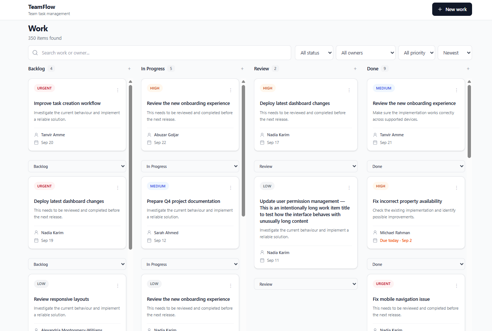
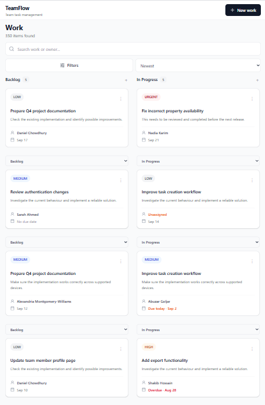
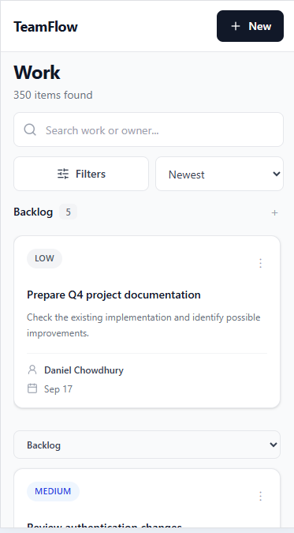

# Team Task System

A modern and responsive Team Task Management System built with React, TypeScript, Vite, and Tailwind CSS.

This project was developed as a frontend-focused assessment to replace a spreadsheet-based team workflow with a simple, fast, and easy-to-use task management interface.

## Features

* Kanban-style task board
* Search tasks by title, description, or owner
* Filter tasks by status, priority, and owner
* Sort tasks
* Pagination for large datasets
* Create new work items
* Edit existing work items
* Quickly update task status
* View detailed task information
* Clear priority indicators
* Due-date visibility
* Assigned and unassigned work visibility
* Search, filter, sort, and pagination state synced with URL
* Responsive design for mobile, tablet, and desktop
* Keyboard-friendly interactions
* Toast notifications for user actions
* Custom product-style interface
* Realistic fixture data with different task scenarios

## Tech Stack

* React
* TypeScript
* Vite
* Tailwind CSS
* React Router
* Radix UI
* Lucide React

## Screenshots

### Desktop



### Tablet



### Mobile



## Workflow

The application uses a simple Kanban workflow:

```text
Backlog → In Progress → Review → Done
```

Each task can be moved between stages using the status control available on the task card.

## Main Features

### Work Board

The main dashboard provides a clear overview of team work.

Each column represents a different stage of the workflow, allowing users to understand the current state of work at a glance.

### Search and Filtering

Users can quickly find relevant work using:

* Search
* Status filter
* Priority filter
* Owner filter
* Sorting
* Pagination

The current search and filter state is reflected in the URL, making filtered views easy to share and revisit.

### Create Work

Users can create a new work item by providing:

* Title
* Description
* Status
* Priority
* Due date

### Edit Work

Existing work items can be updated without leaving the main workflow.

### Work Details

Clicking a work item opens a detail view containing more information about the selected task.

### Quick Status Update

Task status can be changed directly from the task card without opening the full detail view.

## Responsive Design

The interface was designed for multiple screen sizes:

* 375px — Mobile
* 768px — Tablet
* 1280px — Desktop

The layout adapts to smaller screens to avoid horizontal scrolling and maintain usable touch targets.

## Accessibility

Accessibility was considered during implementation.

The application includes:

* Keyboard-accessible interactive elements
* Visible focus states
* Semantic HTML where appropriate
* Accessible buttons and controls
* Clear visual states
* Readable text and contrast
* Keyboard interaction for task cards

## Project Structure

```text
src/
├── components/
│   ├── layout/
│   │   └── AppShell.tsx
│   │
│   └── work/
│       ├── WorkBoard.tsx
│       ├── WorkColumn.tsx
│       ├── WorkCard.tsx
│       ├── WorkDetailDrawer.tsx
│       ├── CreateWorkDialog.tsx
│       └── WorkFormDialog.tsx
│
├── data/
│   └── fixtures.ts
│
├── pages/
│   └── WorkPage.tsx
│
├── types/
│   └── work.ts
│
├── App.tsx
└── main.tsx
```

## Installation

Clone the repository:

```bash
git clone https://github.com/shakibmuhammad/team-task-system.git
```

Navigate to the project:

```bash
cd team-task-system
```

Install dependencies:

```bash
npm install
```

Start the development server:

```bash
npm run dev
```

## Data

This version is frontend-only and uses local fixture data.

No backend or external database is connected.

The application uses realistic sample data to demonstrate different scenarios, including:

* Assigned work
* Unassigned work
* Different priorities
* Overdue tasks
* Today's tasks
* Future due dates
* Tasks without due dates
* Short and long titles
* Different descriptions
* Multiple team members
* Different workflow states

## Design and Product Decisions

### Why Kanban?

A Kanban-style board provides an immediate visual overview of the team's workload and current progress.

### Why Quick Status Update?

Status changes are common actions. Allowing users to update status directly from the card reduces unnecessary clicks.

### Why URL-based State?

Keeping search, filtering, sorting, and pagination in the URL makes the current view shareable and allows browser navigation to work naturally.

### Why Fixture Data?

Since this implementation is focused on the frontend assessment, realistic local data was used to demonstrate the UI and interactions without requiring backend infrastructure.

## Future Improvements

If this project were extended beyond the assessment, the following features could be added:

* ASP.NET Core Web API
* PostgreSQL database
* Authentication and authorization
* Real-time task updates
* Drag-and-drop task movement
* Activity history
* Comments
* Notifications
* Team and member management
* Server-side filtering and pagination
* Persistent task storage

## AI Usage

AI tools were used during development as a development assistant for:

* Exploring implementation approaches
* Debugging issues
* Reviewing component structure
* Improving code quality
* Generating development ideas

All implementation decisions were reviewed and adapted to fit the project's requirements.

## Project Status

Frontend: Completed

Backend: Not implemented

Database: Not implemented

## Author

Md. Shakib Hossain

Full Stack Developer | ASP.NET Core | ReactJS | TypeScript

## AI Usage

ChatGPT was used as a development assistant during this project.

It helped with:

* Understanding and breaking down the assessment requirements
* Planning the frontend architecture and component structure
* Discussing UI/UX and responsive design approaches
* Debugging React and TypeScript issues
* Reviewing implementation approaches and suggesting improvements
* Explaining React concepts and best practices when needed
* Reviewing code structure and identifying potential issues
* Helping with README documentation

The final implementation, design decisions, and code were reviewed and adapted based on the project's requirements. I remain responsible for understanding the submitted code and its implementation.

